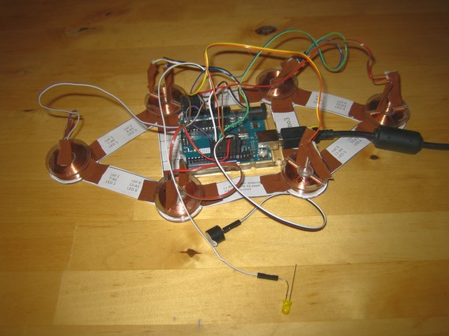
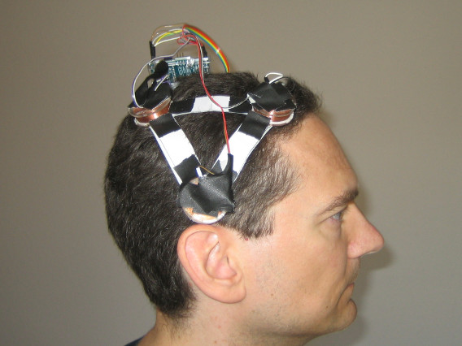

TMSuino3
========
 
_A low-cost arduino-based TMS ([transcranial magnetic stimulation](https://en.wikipedia.org/wiki/Transcranial_magnetic_stimulation)) device._

## Introduction

Several years ago I found out that _fear_ seems to help people with bipolar disorder. Therapies only work, if patients are "aware of possibly dramatic consequences" AKA "have fear".
While most people think of the motivational aspect of fear I thought about brain chemistry. It makes sense to activate the brain in times of distress to help survival. Increase probability for a good idea how to deal with the sabertooth tiger by boosting the brain.
And there is a saying which gives another hint: Fear makes you wide awake. 

This would mean that bipolar disorder can be treated by boosting brain function or a part of the brain.

So I went looking for brain scan (PET) data. By comparing PET scan data of healthy people and bipolar disorder patients I hoped to find a brain region that is responsible for bipolar disorder. I was quite surprised to find out, that all scans of bipolar disorder patients are kept secret. Over 7000 patients have been scanned by scientists and not a single one of these scans is available to the public. On the other hand there are thousands of scans available of any other mental ailment known to man. Look for yourself, here is the [list of publicly available brain scan datasets (table 1 on page 4)](https://www.researchgate.net/profile/Krzysztof_Gorgolewski/publication/267452254_Making_big_data_open_Data_sharing_in_neuroimaging/links/544ffaae0cf249aa53da88b6.pdf).

I came to the sad conclusion that there might be a cover-up of a viable treatment method.

Delving deeper I realized that bipolar disorder scan data was available to the public a few years ago. But scientific community and journals launched a shitstorm against it. 
You can read this interesting piece: [Why share data? Lessons learned from the fMRIDC (page 4)](https://www.ncbi.nlm.nih.gov/pmc/articles/PMC3807237/pdf/nihms518941.pdf).

After that I was convinced there is something to it. I was angry and I thought: "If they work so hard to keep that data secret there must be something really obvious in that data." If a specific part of the brain cancels bipolar disorder when stimulated then I am going to find it. Via the hard way if necessary.

So by trial and error with a patient test person I set out to do just that.

The brain can be stimulated by magnetic fields and these fields can be shaped to target only specific parts of the brain. The result of our efforts is TMSuino.
It is hard to come up with a solution to a huge problem with only one test person, no budget and no diagnostic equipment whatsoever.

But watching my test persons' reactions it became clear: There is an effect. Not clear and consistent enough to count for a full-out treatment. But something good happens.
I became astounded by that: "Why is there a universal boycott on TMS?" I asked myself.

I finally concluded it must be about money. TMSuino for example could be mass-produced for less than 10 dollars. And a professionally produced device would work for years. There's not much money to earn here.

On the other hand many drugs for bipolar disorder patients are sold for over 300 dollars. **Every month.** 

I believe that's the motive.

But how is it possible to keep this secret?

The normal way would be for some scientists to do research, write a paper and a scientific journal to publish that paper. But one of the most important editors of medical journals has interesting terms and conditions on their website:
Just by surfing the site you loose all rights for trial by jury against this editor. Just by accessing the site you consent to a private court, an "arbitration". In this "arbitration" chapter of these terms and conditions it is defined that all __groups__ loose this arbitration, only individuals can hope to sue the editor successfully. But since all scientific papers are written by a group of authors this means the authors can never win. They have lost all rights.
Yet another clause in this "arbitration" chapter of these terms and conditions the arbitrators are allowed to demand an arbitrarily large sum of money for their "work".
I have more details about this in the [evidence section](indizien/README.md). 

So it could work this way: Researchers write a paper and send it to the journal. But the journal just doesn't publish it. After months of waiting the researchers want the rights for publication back and enter the arbitration process. There they find out that they loose this process, since they are a group. Finally they get a multi-million dollar invoice from the arbitrators making them instantly bankrupt. Which forces them to give their patent rights to the arbitrators.

Finally the researchers might be threatened to keep quiet about all this. And there are hints this happens: My example is professor Dissing from the university of Copenhagen. He created a TMS device to treat major depressive disorder. [Here is an article about it](https://uniavisen.dk/en/an-inventors-triumph-and-frustration/).
This device would be extremely cheap. It can be built with an arduino, an arduino motor driver shield and seven coils. All in all parts for less than 150 dollars. But guess what, it isn't sold, you can only lease it - for an absurdly large sum: 1000.- dollars every month. It's pretty obvious this man is threatened to do this to keep it off the market. 

That made me even more angry, so I decided to do something about this.

The journals seem to be corrupt, patent holders are threatened. And no company can sell something that isn't approved by the FDA, which is only possible if there are publications in scientific journals. So the journals control what the government does!

That made me even more angry, because this scheme seemed to be indestructible.

But finally I found the solution: I just have to show people how they can build TMS devices themselves. Using simple parts which corrupted scientists cannot withhold from the markets, using a design that is free of patent claims.
Using a design that can be easily adapted and changed, so a community of bipolares can take research into their own hands.

The main hurdle for this was to create a design that avoids soldering altogether, but I managed to do this.

This github project is a step-by-step manual. Anyone with a high school diploma should be able to follow it and build a TMSuino themselves. That's what I was aiming for. 
TMSuino's principle of operation is taken from a scientific paper published in the 1990s. So it is free of valid patent claims. Costs for parts, materials and shipping should be around 150,- dollars/euros.
There is **no soldering required!** Estimated build time is 2 1/2 hours.

But there's even more. 

Most people don't know that bipolar disorder is one of the deadliest illnesses on earth. Worldwide over one million patients die every year.

Bipolar disorder patients are often unable to recognize their own manic phase, so they think they don't need any medication.
They quit taking their meds, and so the manic phase runs free - they become sky-high like a drug addict.

The higher and longer the "high" the deeper and longer the "low". The depressive phase which will eventually happen, unavoidably so, drives them to commit suicide.

And here is the thing: In some of our tests an active manic phase was cancelled after a 30 minute session with TMSuino.

The contrast experienced by such a quick emotional change increased the test persons' self-awareness: He became aware of the symptoms of his manic phase.
After a few months the test person spontaneously did a TMSuino session because he had recognized a manic phase all by himself.
Asked, why he wanted to break out of the manic phase, he gave a surprising answer:
"It feels relaxing to me to use TMSuino."

TMSuino had a wonderful effect on this test person!

The first TMSuino prototype was created in February 2017. Over the time of many months my conviction became stronger and stronger:
I am believing that TMS reduces the suicide rate of bipolar disorder patients.

And if this turns out to be true, if TMS can reduce the suicide rate, then the actions of the journals could be the biggest organized homicide in history.

My hope is to bring an end to this mass murder by placing research into the hands of those that are fundamentally uncorruptible: The bipolares themselves. Beginning by publishing TMSuino.

As it turned out the first people I told about TMSuino got into danger. I don't know if they are still alive.
I believe one of them has been assassinated with [Ephedrine](https://en.wikipedia.org/wiki/Ephedrine).
Drinks and food can be easily laced with Ephedrine, causing intense mania, paranoia and panic attacks. The death of the victim looks like a "regular" bipolar disorder death.

Now you ask who should do something like that?

People with bipolar disorder are often quite successful or creative between phases. In some patients the manic phase can be managed as a power source to reach peak performance.
This naturally attracts jealousy. A lot of jealous people like to put the other one down, it makes them feel better. But putting someone down through action is easily discovered.
Bipolar disorder patients are naturally put down by their depressive phase. So anyone with a jealousy problem reaching the sociopath level will be naturally drawn towards some kind of relationship with bipolares.
A whole group of bipolares will satisfy their sociopathic urges nearly constantly, so the ones with the worst problem take up "social" positions "voluntarily".

I am beginning to realize that all relationships, including marriage, can be based on some unhealthy emotional exploit.
For a spouse to happily deal with a constantly depressive and lamenting partner they have to be either a saint or get some kick out of it. And real saints are really rare.
And we all know that a life insurance payout can be like winning the lottery. As these insurances don't pay in case of suicide the trick is to encourage risk taking during the manic phase. And giving devoted support during the depressive phase.
Better safe than sorry: Keep all non-bipolares out of the loop.
Watch if relationships devolve into hate/disgust/indifference when several of your depressive phases don't come to pass.

I am convinved this is necessary: At least one method to treat bipolar disorder has been supressed for decades. A huge number of people must have found out, but haven't been able to stop it. The only explanation for this is that people have been too naive. And got the proverbial knife in the back.

Next to companies selling medications there are other entities that might profit from bipolar disorder patients.
The mania of bipolares often goes hand in hand with hyper-religiosity. So bipolares can be seen as a threat or a tool to people with fundamentalistic positions.

And on top of it there are medical/psychiatric professionals which might take a huge scandal in their field of expertise as a hard blow to their egos.
They might be tempted to act in ways that might bring harm you.

All users/testers/improvers of TMSuino must be very careful and should keep their use of and work on TMSuino secret. Make sure to:
- buy the same medications you relied upon
- stay a member of groups you've been a part of
- do the same lamenting you did before, especially when with people that do not have bipolar disorder
- filter out those people that are strong cases of bipolar disorder and speak to them about your experiences privately without anyone listening in and without leaving traces or proof
- watch if relationships deteriorate if your risk taking / depressions are reduced
- watch how the attitude of fundamentalists towards you changes
- be careful to not hit the egos of professionals

After all this explaining and warning you are probably excited. I hope for TMSuino to be the beginnig of something great. And here it is:

## Table of contents

- [The Picture](#picture)
- [Parts and Materials](#parts-and-materials)
- [Building it](#building-it)
- [Concerns](#concerns)
- [Background](#background)
- [License and Disclaimer](#license-and-disclaimer)

## Picture

Here's a picture of it:

It is worn like a cap:

## Parts and Materials

Here is a quick overview:

1. Arduino UNO R3 - as driver module

2. Six coreless coils - to create magnetic fields

3. Jumper wires - for wiring the coils to the Arduino

4. Active Buzzer - for informational sounds

5. LED - for troubleshooting

6. Tape / cloth tape - to put everything together

7. Double faced tape - to fasten the coils onto the cap

8. 2 sheets of paper (DIN A4 or USLetter)

9. Tools: A sturdy pair of scissors - for all cutting tasks

10. Tools: A printer - to print the placement pattern

11. Tools: A desktop/laptop computer - to upload TMSuino's software to the Arduino

12. Optional parts: USB power adapter or 9V power adapter or 9V battery holder - as alternative power sources

Now that you have an overview you might want to know the specifics, and where these parts can be bought: [Here are more details and links to sources](partlist/README.md)

## Building it

It takes about two and a half hours to build the device.

The following descriptions are quite long. It's best to read them until you come across a _"Do it now"_ line, so you know all important details before starting each step.

1. [Make the cap](coilsetup/README.md)

2. [Connect all wires](wiring/README.md)

3. [Upload TMSuino3 software to Arduino](code/README.md) 

4. [Do some debugging if necessary](debugging/README.md)

5. [Isolate all wires](fixing/README.md)

6. [Learn how the maintenance LED works](troubleshooting/README.md)

TMSuino3 has two stimulation routines. It continuously toggles between both, beeping shortly when the routine is changed.
One of these routines runs with a self-test. If a wire connection is broken during this routine TMSuino3 stops in error mode immediately.
If a connection is broken during the other routine it can take up to a minute until TMSuino3 switches into error mode.

## Concerns

Some people might be concerned about putting magnetic fields on the brain. [Have look at professer Dissing's device for depression patients](https://uniavisen.dk/en/an-inventors-triumph-and-frustration/).
TMSuino uses much smaller coils than those of the Dissing device.

## Background

If you are curious why mentioned parts and materials where selected, [here is some background info](rationale/README.md).

But you don't need to know this to build and use the device.

## License and Disclaimer

For anything to be low-cost it must be open-source. Otherwise third parties will always take their share.

Therefore this work is licensed under [CC0](License-CC0.txt); putting all of it into the public domain. 

## Legal issue

For legal reasons every person that wants to try this device has to build it by themselves.

