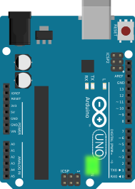
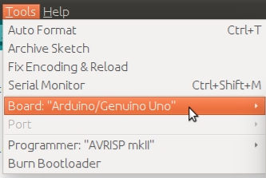
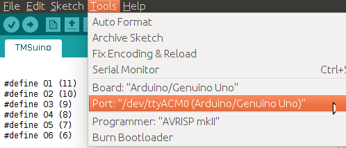
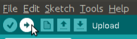
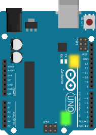

# Upload software to Arduino

There are very good Arduino tutorials available on the internet. As such I am only providing a rough outline of how to do it.

1. Install the [Arduino IDE](https://www.arduino.org/)

2. Connect the Arduino via the USB cable. 
  A green LED on the board lights up.
  
  

3. Download the [.ino file](../TMSuino3/TMSuino3.ino) and open it with the Arduino IDE.

4. In the Arduino IDE open the "Tools" menu and make sure "Board:" is set to "Arduino/Genuino UNO"

  
  
5. In the same menu make sure "Port:" is not greyed-out. It should point to the Arduino device as "COM1" or "COM2" or "COMx" or "/dev/ttyACM0" depending on your operating system.

  
  
  On ubuntu you might need to type: 
```bash
sudo chmod a+rw /dev/ttyACM0
```
  otherwise the next step might fail.

6. Click "Upload"

  
  
  There is a row of three yellow LEDs on the board. The two leftmost yellow LEDs on the board should flicker for a short moment, that's the upload.

7. TMSuino should beep several times when the upload occurs. So this is the opportunity to mount the buzzer correctly. 
  If there was no beeping during upload, swap the buzzer's wires and upload again.
  If it doesn't work despite using the correct pin sockets (13 and GND), you might have accidentally used a _passive buzzer_.
  Many Arduino starter kits come with both types (active and passive). And they look very much alike.
  Have a look for another buzzer and try that one.
 
8. After a few seconds, you should hear a sequence of three beeps (beeeep beep beeeep). TMSuino3 always beeps like this on startup.
  There is a row of three yellow LEDs on the Arduino UNO board. The rightmost will light up with every beep.
  If it beeps and blinks nonstop without rhythm, one of the coil connections is broken or connected in the wrong way.
  In that case go back to wiring and check all connections. Hit the Arduino's reset button afterwards to restart the self-check.
  **If you have problems even after re-checking the wiring look into [Debugging](../debugging/README.md)**

  | OK | Error |
  |----|----|  
  |  |  |


**If only the green LED is on and there's no beeping/blinking, go on to [isolate all wires](../fixing/README.md).**

**If you have problems even after re-checking the wiring look into [Debugging](../debugging/README.md).**

[Main Page](../README.md#building-it)
