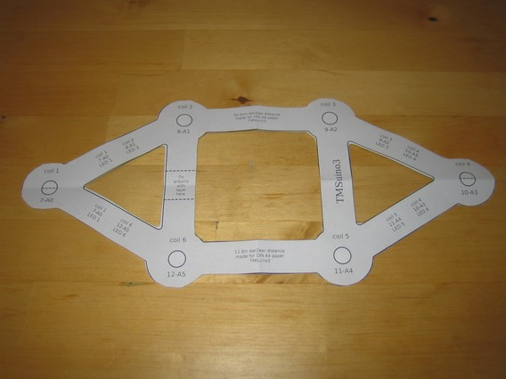
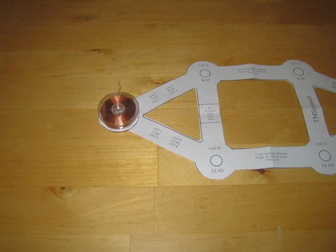

# Coil Setup

This is the coil pattern I designed. The coils are laid out at the circle positions and then connected with tape along the displayed bands.
The lengths of all the bands connecting the coils are all the same. This is by design, to spread the field over the brain.
The size of the pattern should be selected so that the outer coils are 3/4 inches (2cm) above the ears.
Measure the distance between the ears along the top of the head, subtract 1.5 inches (4cm) and use a matching print pattern from the list below.
It's best to use a measuring tape. If you don't have one you can [print this one](../print-patterns/ruler.pdf?raw=true).

The print pattern pages are in lanscape mode.

Patterns, imperial:

- [9.0 inch](../print-patterns/coilpattern-9.0in-A4-od1.4-id0.4-tw0.79.pdf?raw=true)
- [9.5 inch](../print-patterns/coilpattern-9.5in-A4-od1.4-id0.4-tw0.79.pdf?raw=true)
- [10.0 inch](../print-patterns/coilpattern-10.0in-A4-od1.4-id0.4-tw0.79.pdf?raw=true)
- [10.5 inch](../print-patterns/coilpattern-10.5in-A4-od1.4-id0.4-tw0.79.pdf?raw=true)
- [11.0 inch](../print-patterns/coilpattern-11.0in-A4-od1.4-id0.4-tw0.79.pdf?raw=true)
- [11.5 inch](../print-patterns/coilpattern-11.5in-A4-od1.4-id0.4-tw0.79.pdf?raw=true)
- [12.0 inch](../print-patterns/coilpattern-12.0in-A4-od1.4-id0.4-tw0.79.pdf?raw=true)
- [12.5 inch](../print-patterns/coilpattern-12.5in-A4-od1.4-id0.4-tw0.79.pdf?raw=true)
- [13.0 inch](../print-patterns/coilpattern-13.0in-A4-od1.4-id0.4-tw0.79.pdf?raw=true)
- [13.5 inch](../print-patterns/coilpattern-13.5in-A4-od1.4-id0.4-tw0.79.pdf?raw=true)
- [14.0 inch](../print-patterns/coilpattern-14.0in-A4-od1.4-id0.4-tw0.79.pdf?raw=true)

Patterns, metric:

- [24cm](../print-patterns/coilpattern-24.0cm-A4-od3.6-id1.0-tw2.0.pdf?raw=true)
- [25cm](../print-patterns/coilpattern-25.0cm-A4-od3.6-id1.0-tw2.0.pdf?raw=true)
- [26cm](../print-patterns/coilpattern-26.0cm-A4-od3.6-id1.0-tw2.0.pdf?raw=true)
- [27cm](../print-patterns/coilpattern-27.0cm-A4-od3.6-id1.0-tw2.0.pdf?raw=true)
- [28cm](../print-patterns/coilpattern-28.0cm-A4-od3.6-id1.0-tw2.0.pdf?raw=true)
- [29cm](../print-patterns/coilpattern-29.0cm-A4-od3.6-id1.0-tw2.0.pdf?raw=true)
- [30cm](../print-patterns/coilpattern-30.0cm-A4-od3.6-id1.0-tw2.0.pdf?raw=true)
- [31cm](../print-patterns/coilpattern-31.0cm-A4-od3.6-id1.0-tw2.0.pdf?raw=true)
- [32cm](../print-patterns/coilpattern-32.0cm-A4-od3.6-id1.0-tw2.0.pdf?raw=true)
- [33cm](../print-patterns/coilpattern-33.0cm-A4-od3.6-id1.0-tw2.0.pdf?raw=true)
- [34cm](../print-patterns/coilpattern-34.0cm-A4-od3.6-id1.0-tw2.0.pdf?raw=true)
- [35cm](../print-patterns/coilpattern-35.0cm-A4-od3.6-id1.0-tw2.0.pdf?raw=true)

Do it now (measure size and print).
 
## Pattern cut-out

Read [here the step-by-step procedure](../cutout/README.md) to reach this cut-out with minimum effort.

Do it now.

## Put tape on backside

Paper is not strong enough to hold everything in place. So turn the pattern around ...

... and put tape on its backside like this:

<!-- -->

Make sure not to stretch the tape, as the paper will curl if you do so.
Here is an example. These strips of paper are identical, the strips of tape are identical as well. But when I put the tape onto the paper I stretched the tape for the first strip (you can see it overflows the right marking) and it curls:

So be gentle!

Do it now.

## Place coils

Turn the pattern around again and fasten the coils with double-faced tape.

<!-- -->

<!-- -->

<!-- -->

<!-- -->

Do it now.

## Check size

Put pattern with coils on your head. Is there a small distance (3/4 inches / 2cm) between your earlobes and the corner coils on both sides?
That would be perfect. If the side coils touch the earlobe you should select a smaller pattern and start over.

If there's more than 1.2 inches (3cm) space between earlobes and coils on both sides (so approx. 2.5 in / 6 cm total) you should select a larger pattern.

Do it now.

## Run tape between coils

If the size has been tested and proven to be ok, use some tape to fasten the coils even further:

<!-- -->

Make sure the tape does not overflow the paper template, otherwise hair will later stick to the tape.

Do it now.

## Continue with [wiring](../wiring/README.md)

[Main Page](../README.md#building-it)
