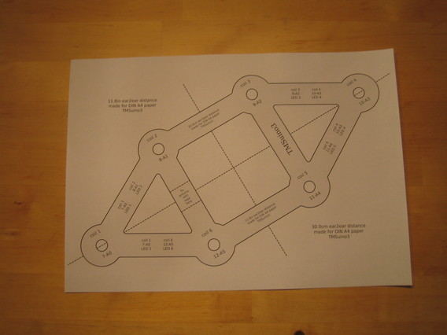
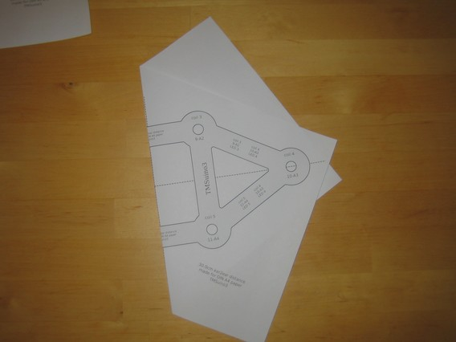
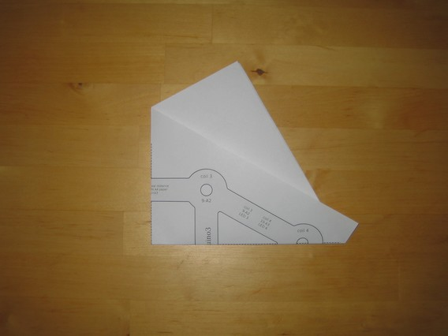
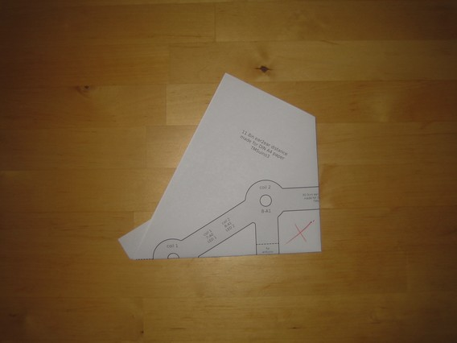
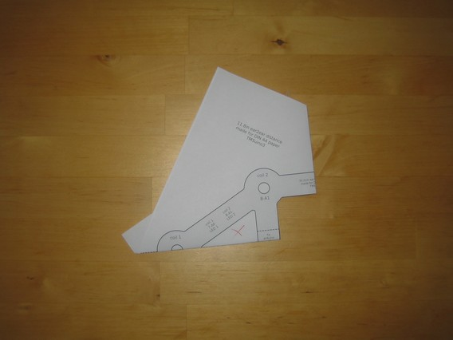
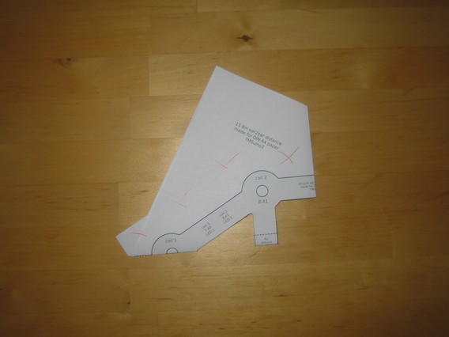
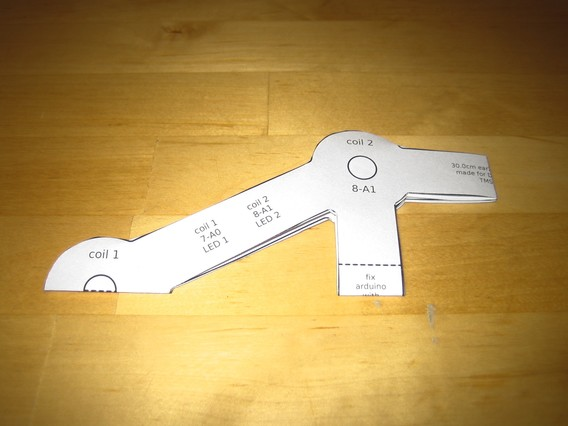
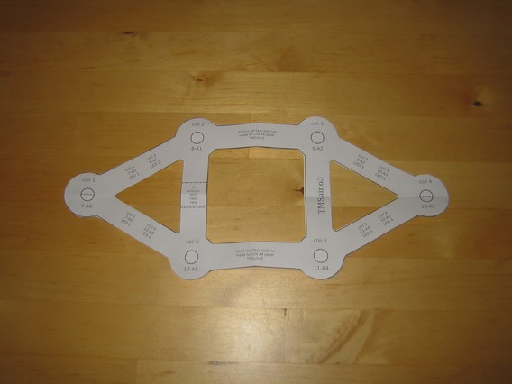

Pattern cut-out step by step
========

First fold it twice along the dashed lines:

<!-- -->

Then it is easier to cut:

<!-- -->

<!-- -->

<!-- -->

The inner holes are only shown to remind you where putting tape to fasten the coils wouldn't work, they don't need to be cut.

And now unfold it again:

Tadaa! Do it now.
That's it, continue with [placing the coils](../coilsetup/README.md#place-coils)

[Main Page](../README.md#building-it)  |  [Coil setup](../coilsetup/README.md)

