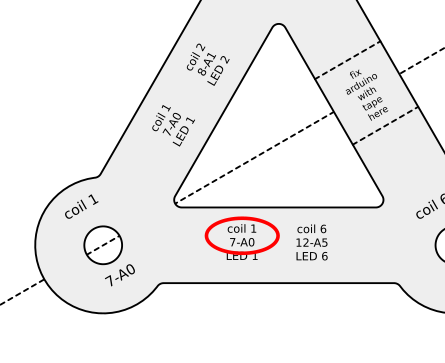

# Debugging / Diagnostics

This chapter assumes all wires are connected.
If problems persist the best way is to get more info first, like this:

1. Connect the Arduino via USB and start up the Arduino IDE.

2. Download the [Diagnostic .ino file](../TMSuino3-Diagnostic/TMSuino3-Diagnostic.ino) and open it with the Arduino IDE.

3. Steps like before:
  In the Arduino IDE open the "Tools" menu and make sure "Board:" is set to "Arduino/Genuino UNO"
  In the same menu make sure "Port:" is not greyed-out. It should point to the Arduino device as "COM1" or "COM2" or "COMx" or "/dev/ttyACM0" depending on your operating system
  Linux users: remember to call the 
```bash
sudo chmod a+rw /dev/ttyACM0
```
  command whenever you connect the Arduino.

4. In the Arduino IDE open the "Tools" menu and open the "Serial Monitor"
  <!--   -->
  

5. Make sure the "Serial Monitor" is set to "9600 baud", it's in the lower right status of the Serial Monitor window.
  <!--   -->
  

6. Click "Upload"
  <!--   -->
  

7. Now messages should appear in the "Serial Monitor" window, as shown in this picture. 
  That's the diagnostic tool telling you problems with wire connections:
  <!--   -->
  
  <!--   -->
  Note: If one of the wires is not connected a lot of false readings are created. So first connect everything before using this tool.
  It _shouldn't_ be used to tell you which wire to connect to which socket. That's what the wiring-cheat-sheet is for:
  <!--   -->
  

8. When everything is connected properly the messages should look like this:
  <!--   -->
  

9. **[Re-upload the normal code](../code/README.md)!!!**

   As soon as the diagnostic tool is uploaded, TMSuino3 does not work anymore until you [re-upload the normal code](../code/README.md)!!!

Do it now.

[Main Page](../README.md#building-it)  |   [Upload software to Arduino](../code/README.md)
