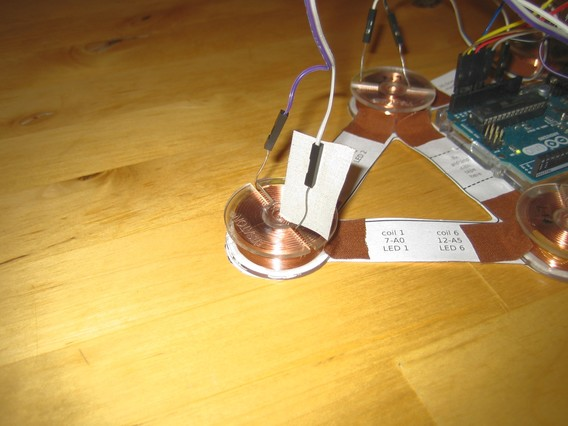
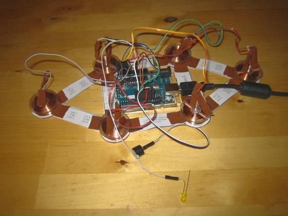
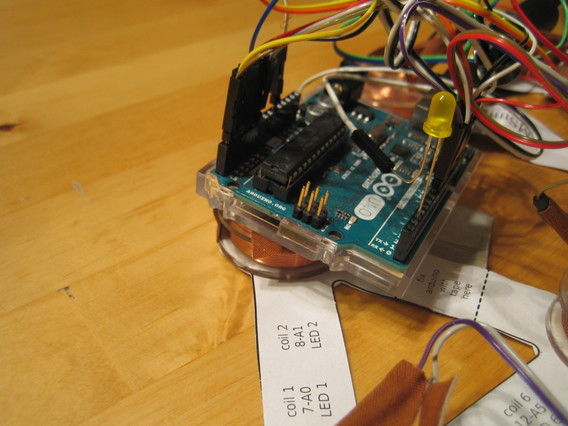

# Isolate jumper wires

This step is to make sure the blank ends of the coil wires are isolated. And also to make it harder for the wires to loosen. 
I used the tape for this:

<!-- -->

<!-- -->
The overall result should look like this:

Do it now.

# Tape Arduino to coil

**This step is only valid for patterns of size 11.5 inches (29cm) or smaller.**

The idea is to tape the Arduino on top of coil 2. First bend the wires of coil 2 down:

Then cover it with two stripes of tape:

Put a large piece of double-faced tape on top:

<!-- -->

Then put the Arduino on top:

The final result should look like this:

Do it now.

# You did it! 

TMSuino3 is now ready for use.

Please keep in mind that TMSuino3 is **not** water-proof. Only use it when your hair is dry!

[Go back to Main Page](../README.md#building-it)

