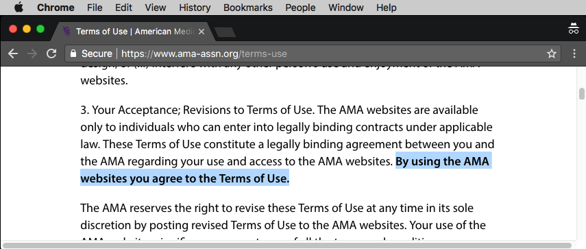
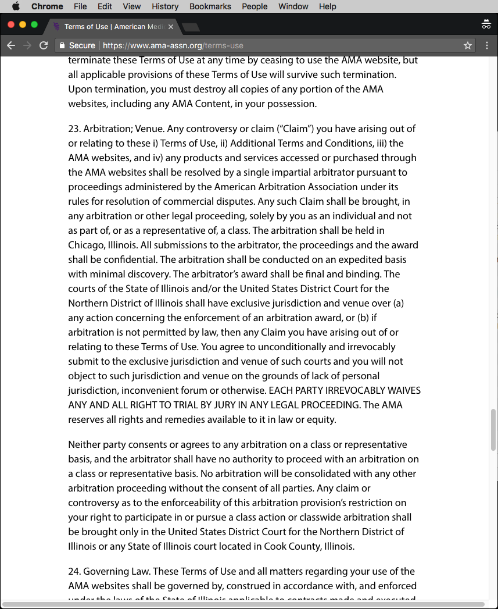

Evidence
========

As I mentioned before the editor of the most important scientific medical journals has "curious" terms and conditions.

The first is, that you accept their terms just by accessing their website:

And the really big thing is the arbitration trick:

Section 23 means:
- A single person from a club called "American Arbitration Association" makes the final decision.
- Only a single person, alone, without support has the right to call for an arbitration.
- The arbitration will be held in Chicago, Illionois. You know what Chicago is famous for.
- The arbitration will be held in secret. You can't even tell your spouse why you're travelling to Chicago.
- The arbitrator gets the "award" he or she wants, without discussion - just what Chicago is famous for.
- Some specific courts of Illinois will force you to pay this "award".
- Those specific courts of Illionois will also decide anything that may be exempt from arbitration due to laws of your local jurisdiction.
- You irrevocable loose your right to trial by jury. Trial by jury is the most important factor for freedom. Any society without it will ultimately end in dictatorship.
- If the arbitrator might become refined for some reason - maybe by recognizing an atrocious crime - then his decision won't count: Neither the editor nor you may accept such a decision.

You see, there is no hope for you if you keep believing in police, courts, government, doctors, scientists, media and church.

Or any other "authority" or organization which claims to do something, anything good.

