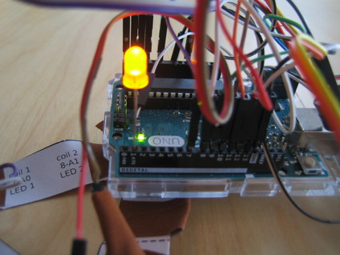
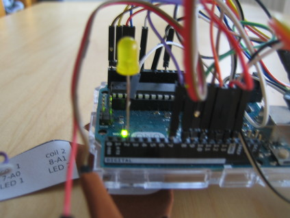
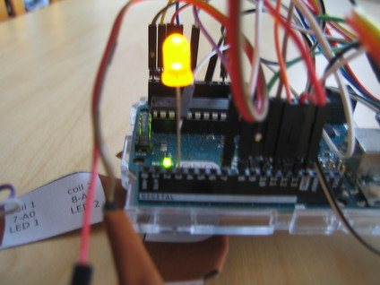
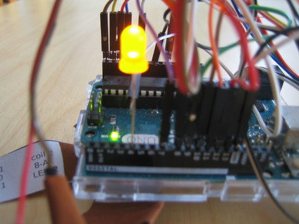
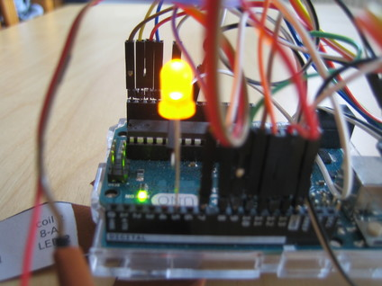
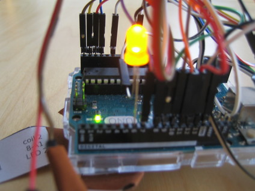

# Troubleshooting "on the road"

Despite all measures taken to avoid any problems the wires are prone to loosen. 

TMSuino falls into error mode in that case, will beep and blink and not work anymore until the problematic wire is fastened again.

**So here is a little example:**

I accidentally pulled a wire, TMSuino3 has started to beep and blink, and I was using the maintenance LED:

<!-- -->

<!-- -->

<!-- -->

<!-- -->

<!-- -->

<!-- -->
Now, what do you think? Which coil connection did I accidentally break?

If you think it's coil 2 you are absolutely right.

After fixing the broken connection and restarting the Arduino everything was okay again.

If it's still in error mode after mending the wire connection, repeat the test as there might be another connection broken as well.

[Main Page](../README.md#building-it)  |  [Diagnostic Tool](../debugging/README.md)
