# Wiring

## Overview

The Arduino is kept close to the coils so the standard 25cm (10 inches) length jumper wires are sufficient.

Here is the fritzing-style drawing of how to connect it:

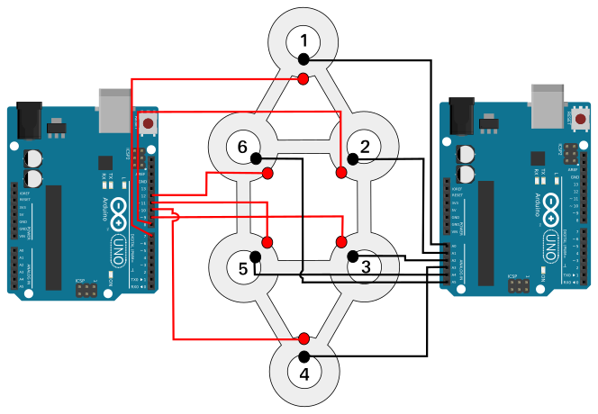

Of course, there is only **one** Arduino. I just displayed it two times so the wires don't cross that much in the drawing.

Do it step by step, connect the outer coil ends with Arduino pins 7 to 12. And the inner coil ends with Arduino pins A0 to A5.
It's all noted on the pattern next to each coil. For example coil 1 has to be connected with Arduino pins 7 and A0:

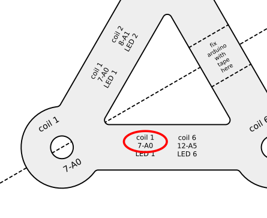

The order is **extremely important** here. Make sure to always connect the outer coil ends to the first pin mentioned.
And the inner coil ends to the second pin. Read the following step-by-step description before starting.

## Parts used

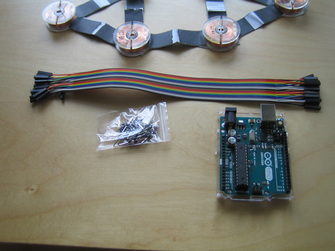

## Preparing jumper wires

I have a 20-wire dupont female-female cable here. It came with a bag of pins to convert the female clips to male clips as desired.

I made two strands of 6 wires each and started to convert it into female-male jumpers:

 

Insert a pin into one side of the originl wires. Then push it against a hard surface until the pin is deep in the socket.
*Do not* put force on the black plastic in the center of the pin, as it will slide off.

Do it now.

After the pins are added, pull the wires apart. 

picture

Do it now.

## Attach wires to coils

The wire ends of the coils bend easily. So be very careful with inserting them into the jumper plug.
They have to go some way in, like the pins in last step - take some time for this! It's a crucial step.
If the coil ends are bend try to straighten them with your fingers before pushing the jumper plug onto them.

The coil ends are prepared for soldering with tin - that's the silvery sheen. 
Sometimes this can be uneven or bulky - e.g. a drop can have formed.
In that case I used my scissors to cut off a few millimeters of the coil end.
They are quite long, even cutting of half an inch (1 cm) should be no problem. 

The begin plugging coils, starting with the first one on the left side:

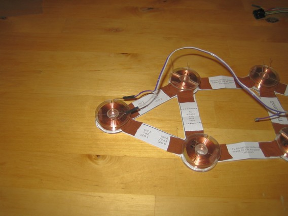

<!--  -->

Here's another picture, now all coils have been plugged to wires:

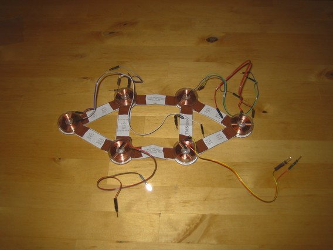

<!--  -->

Do it now.

## Tape Arduino to pattern

**This step is only valid for patterns of size 12 inches (30cm) or larger. 
For smaller sizes the Arduino is mounted differently, which is described later.**
[Skip this step](#connect-outer-coil-end-wires-to-arduino)

Add a piece of tape to fasten Arduino:

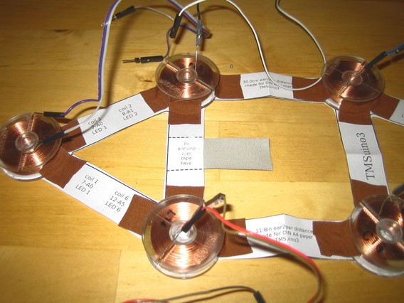

But use a bit of double-faced tape on top, since it is much stronger:

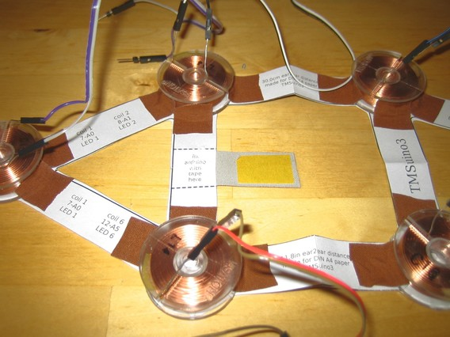

Then fasten Arduino to it. Use your fingers to press the tape against the Arduino.

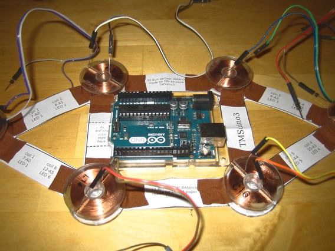

Do it now. 

## Connect outer coil end wires to Arduino

Have a closer look at the coils. There is an outer coil wire end and inner end:

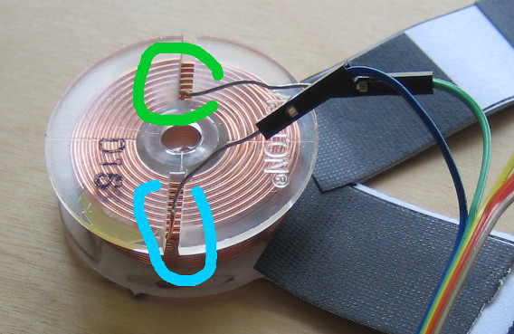

Outer coil end is marked in blue, inner coil end in green.

Take all wires of outer coil ends and connect them to the Arduino.
Starting with coil 1, connecting it to pin socket 7.
The paper pattern is a cheat sheet, telling you which pin socket is meant for each wire:

In the following picture the wire of the outer coil end is connected to pin socket 7:

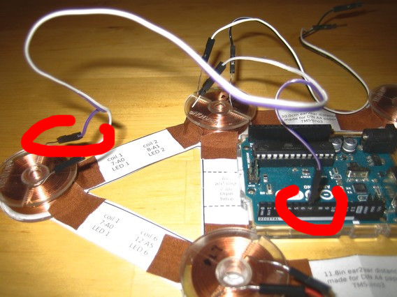

Do this for all 6 coils. Then it should look like this:

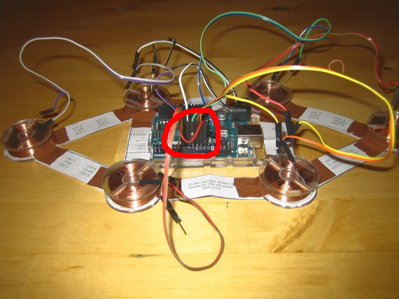

Do it now.

## Connect inner coil end wires to Arduino

Not much to write here. Use the cheat sheet as before and connect the inner coil end wires to Arduino pin sockets A0 to A5.

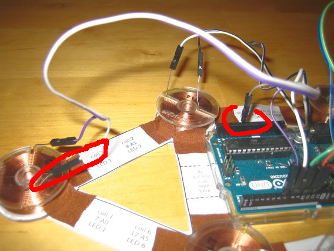
<!-- -->
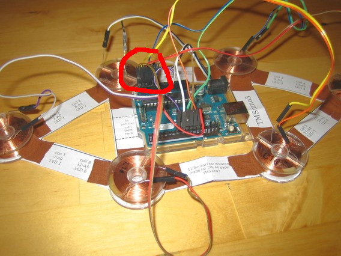

Do it now.

## Adding the buzzer

The buzzer is intended to sound a short beeping sequence at startup and a nonstop beep sequence if the device is stuck in error mode.
Use a jumper wire to connect the plus side of the buzzer to Arduino pin socket 13.
And another jumper wire to connect the minus side of the buzzer to an Arduino GND pin.

If you can't decide which buzzer pin is the plus side choose one randomly. You can change it later, if you hear no beep at startup.

Sometimes buzzers come with a seal. Leave the seal on the buzzer, otherwise the buzzer is too loud.

If you have an unsealed one put a piece of tape over its top hole.

Wind its wires around the other wires so it stays close to the Arduino and cannot come too close to your ears.

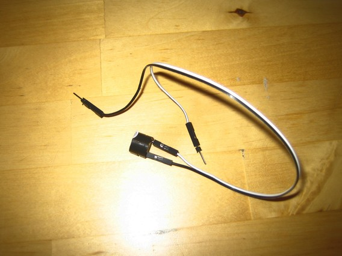

Buzzer without seal, that will be too loud:

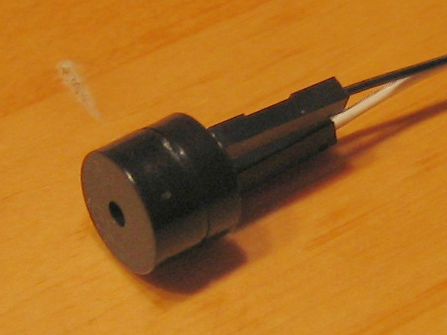

Buzzer with seal:

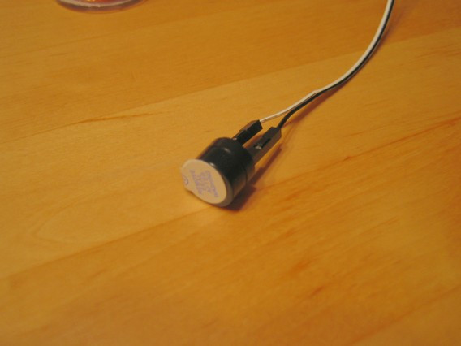

Do it now.

## Adding maintenance LED

With wear and tear a plug could loosen up, TMSuino3 will then be stuck in error mode. 
To help you find the problem the maintenance LED was added in version 3.
How this works is described in a later chapter, but it's best to wire the LED now.

Take a LED (any color you like) and bend the smaller leg of it as shown in the picture.
Use a jumper wire to connect the bended leg with the other Arduino GND pin socket (Arduino has three such pin sockets). 

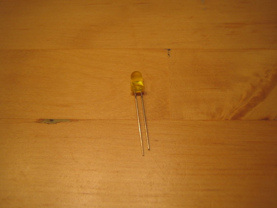
<!-- -->
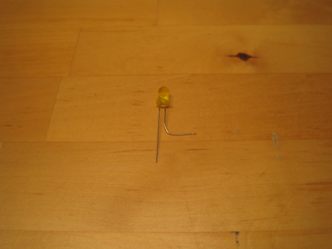
<!-- -->
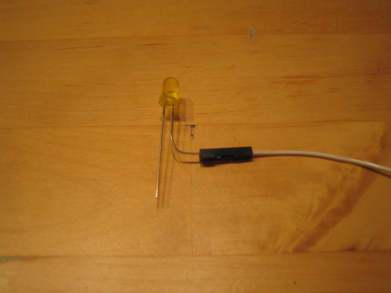

Do it now.

## Straighten coil ends

The coil ends are still bare wire. For the next steps they need to be kept apart. 
Just bend them upright.

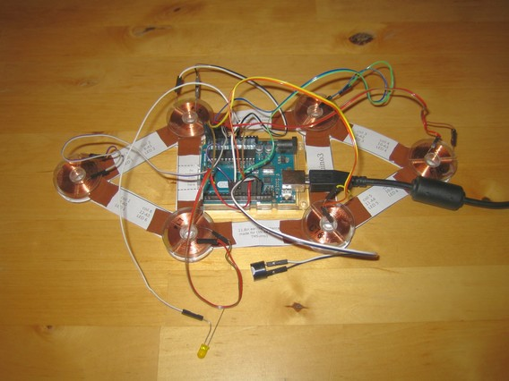

Do it now.

**Half of the work is done now**

**Continue with [Upload software to Arduino](../code/README.md).**

[Main Page](../README.md#building-it)
